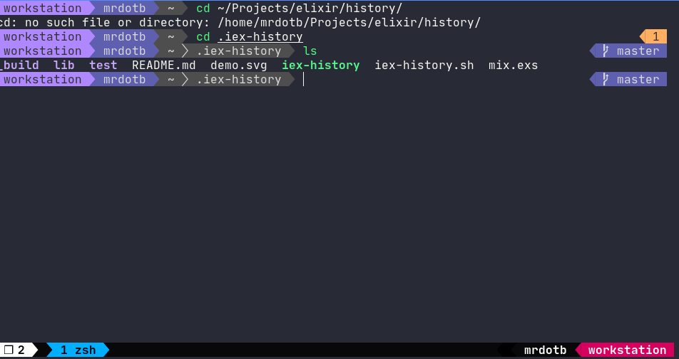

# iex-history



## Installation

Requirements:

- erlang history enabled [how to ?](https://til.hashrocket.com/posts/is9yfvhdnp-enable-history-in-iex-through-erlang-otp-20-)
- [tmux](https://github.com/tmux/tmux/)
- [fzf](https://github.com/junegunn/fzf)
- bash

To install, run the following to your terminal.

```bash
git clone https://github.com/mrdotb/iex-history ~/.iex-history
cd ~/.iex-history
mix escript.build
```

Move the generated binary to somewhere in your `$PATH` or add `~/.iex-history` folder to your `$PATH`

Add the following line in your tmux config

```bash
bind C-r run "bash ~/.iex-history/history.sh #{session_name} #{window_id} #D #{pane_current_command}"
```

The binding I use is tmux prefix ctrl-r.
